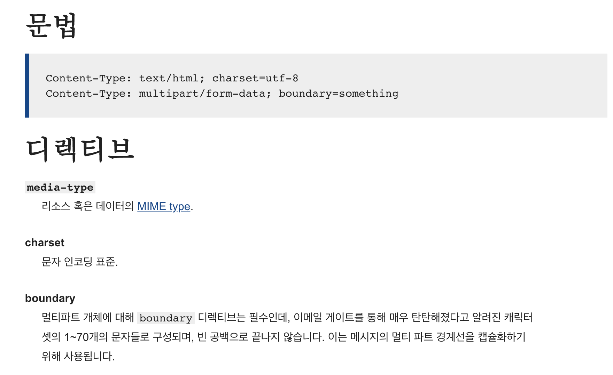
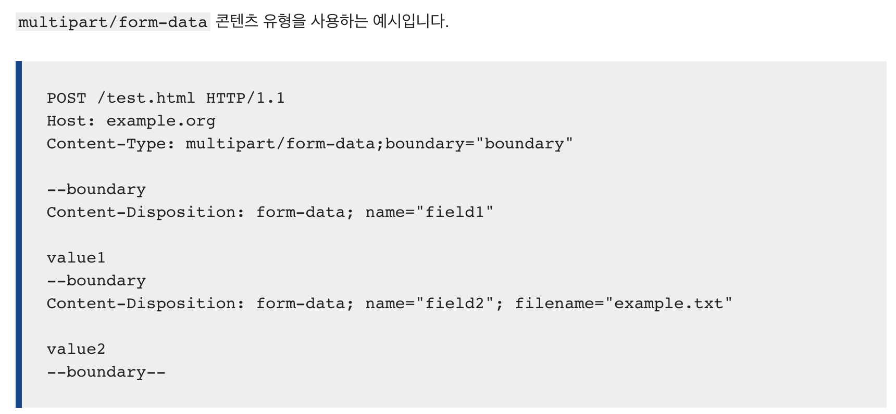

# 오픈마켓 :ferris_wheel:

> <br> 네트워크 호출을 통해 <br><br>(1) 마켓 서버에 있는 전체 상품 목록을 가져와 정보를 화면에 표시합니다.<br><br>(2) 상품을 탭할 경우, 상품의 구체적인 정보를 화면에 표시합니다.<br><br>

| 전체 상품 목록( 리스트형 ) | 전체 상품 목록( 그리드형 ) |
| - | - |
|  |  |

| 상품 상세 내역 | 
| - |
|  |

---
## 주요 학습 내용
- REST API에 대한 이해
- HTTP 메서드의 이해
- Multipart form data, JSON 등 MIME Type의 이해와 활용
  - [:thinking: Multipart form data 를 요구로 하는 경우, HTTP 요청 메소드를 어떻게 작성해야할까?](#thinking-multipart-form-data-를-요구로-하는-경우-http-요청-메소드를-어떻게-작성해야할까)
- URLSessionTask를 활용한 네트워킹 요청
  - [URLSessionTask 활용](#urlsessiontask-활용)
  - [:thinking: 네트워크 요청 과정에 대한 메소드를 일반화할 수 없을까?](#thinking-네트워크-요청-과정에-대한-메소드를-일반화할-수-없을까)
- CollectionView의 이해와 활용
- CollectionView의 리스트 스타일 구현
- CollectionView의 Flow Layout 구현
- Data Prefetching
  - [UICollectionViewDataSourcePrefetching 블로그 포스팅 글 보러가기 (페이지 이동)](https://innieminnie.github.io/prefetching/uitableviewdatasourceprefetching/uicollectionviewdatasourceprefetching/2021/04/25/UICollectionViewDataSourcePrefetching.html)

  - [:thinking: 언제 어떻게 상품 목록 리스트 요청을 파라미터 (목록 페이지) 만 달리하여 반복적으로 수행할 것인가?](#thinking-언제-어떻게-상품-목록-리스트-요청을-파라미터-목록-페이지-만-달리하여-반복적으로-수행할-것인가)
- Generic
  - [:thinking: 네트워크 요청 과정에 대한 메소드를 일반화할 수 없을까?](#thinking-네트워크-요청-과정에-대한-메소드를-일반화할-수-없을까)
- Protocol Oriented Programming
  - [:thinking: 한번의 네트워크 요청으로 다수의 뷰컨트롤러에 같은 데이터를 전달할 순 없을까?](#thinking-한번의-네트워크-요청으로-다수의-뷰컨트롤러에-같은-데이터를-전달할-순-없을까)
- 테스트 더블을 통한 네트워크 통신에 대한 단위테스트(Unit Test) 작성

---
## 트러블슈팅 모아보기
- [:thinking: Multipart form data 를 요구로 하는 경우, HTTP 요청 메소드를 어떻게 작성해야할까?](#thinking-multipart-form-data-를-요구로-하는-경우-http-요청-메소드를-어떻게-작성해야할까)
- [:thinking: 언제 어떻게 상품 목록 리스트 요청을 파라미터 (목록 페이지) 만 달리하여 반복적으로 수행할 것인가?](#thinking-언제-어떻게-상품-목록-리스트-요청을-파라미터-목록-페이지-만-달리하여-반복적으로-수행할-것인가)
- [:thinking: 네트워크 요청 과정에 대한 메소드를 일반화할 수 없을까?](#thinking-네트워크-요청-과정에-대한-메소드를-일반화할-수-없을까)
- [:thinking: 한번의 네트워크 요청으로 다수의 뷰컨트롤러에 같은 데이터를 전달할 순 없을까?](#thinking-한번의-네트워크-요청으로-다수의-뷰컨트롤러에-같은-데이터를-전달할-순-없을까)


---
## 주요 구현 사항
## 1) 네트워크 통신을 위한 모델 타입 구현

<b>Model 디렉토리</b> 
| 타입명 | 요약 |
| :-: | :-: |
| Product | 상품정보 |
| ProductList | 페이지에 따른 20개의 Product 리스트 |
| ProductRegistration | 상품 등록 시 필요한 입력 정보 |
 
```swift
struct Product: Codable {
  let id: Int
  let title: String
  let descriptions: String
  let price: Int
  let currency: String
  let stock: Int
  let discountedPrice: Int?
  let thumbnails: [String]
  let images: [Data]
  let registrationDate: Double
  let password: String
  
  private enum CodingKeys: String, CodingKey {
    case id
    case title
    case descriptions
    case price
    case currency
    case stock
    case discountedPrice = "discounted_price"
    case thumbnails
    case images
    case registrationDate = "registration_date"
    case password
  }
}
```
```swift
struct ProductList: Decodable {
  let page: Int
  let items: [Product]
}
```
```swift
struct ProductRegistration: Encodable {
  let title: String
  let descriptions: String
  let price: Int
  let currency: String
  let stock: Int
  let discountedPrice: Int?
  let images: [Data]
  let password: String
  
  var description: [String: Any?] {[
      "title": title,
      "descriptions": descriptions,
      "price": price,
      "currency": currency,
      "stock": stock,
      "discountedPrice": discountedPrice,
      "images": images,
      "password": password
  ]}
}

```

## 2) 네트워킹 담당 타입 구현
<b>Network 디렉토리</b> 
| 타입명 | 요약 |
| :-: | :-: |
| OpenMarketAPIManager (Singleton 타입) | 네트워크 요청에 따른 데이터 송수신 담당 |
- Singleton 타입 설계 이유: 네트워킹을 통한 데이터 송수신을 담당 개체가 전역 인스턴스로, 다른 타입의 인스턴스들과 원활한 데이터 공유를 하기 위해서 Singleton으로 설정했습니다.

| 타입의 주요 메소드 | 요약 |
| - | :-: |
| <b>func</b> requestProductList() | 상품목록 요청 |
| <b>private func</b> requestProductList(of page: Int, completionHandler: @escaping (Result<ProductList, OpenMarketNetworkError>) -> Void) | 외부에서 requestProductList() 호출 시, 타입 내에서 현재 페이지에 따라 서버에 상품목록 요청 |
| <b>func</b> requestRegistration(product: ProductRegistration, completionHandler: @escaping (Result<Data,OpenMarketNetworkError>) -> Void) | 상품등록 요청 |
|<b>func</b> requestProduct(of id: Int, completionHandler: @escaping (Result<Product, OpenMarketNetworkError>) -> Void)| 하나의 상품 정보 요청|

### :thinking: multipart form data 를 요구로 하는 경우, HTTP 요청 메소드를 어떻게 작성해야할까?
- 문제점:<br>
  상품등록 (requestRegistration) 에 대한 POST 요청시, 단순히 HTTP Method를 POST로 설정한 후, 데이터를 전송할 경우 Content-Type 불일치 관련 에러가 발생했습니다.<br>
--- 
- 원인:<br>
  서버 API에 따르면,<br> 전송하는 문서의 Content-Type (리소스의 media type 나타내는 부분) 은 multipart/form-data 이어야합니다.<br>
  <b> HTTP 헤더 </b> [(참조: MDN HTTP Header 관련 문서)](https://developer.mozilla.org/ko/docs/Web/HTTP/Headers/Content-Type)
  <br>
  또한 multipart/form-data 타입의 문서를 POST 요청하는 Request Message 작성 시, 아래와 같은 메시지를 만들어서 요청해야합니다.<br>

---
- 해결방안:<br>
  requestRegistration 메소드 내에 
  ```swift
    let boundary = "Boundary-\(UUID().uuidString)"
    urlRequest.setValue("multipart/form-data; boundary=\(boundary)", forHTTPHeaderField: "Content-Type")
    let mimeType = "image/jpg"
    let params = product.description 
    urlRequest.httpBody = createBody(boundary: boundary, mimeType: mimeType, params: params, imageArray: product.images)
  ```
  요청메시지의 body 부분에 포함되어야하는 요소 (boundary, mimeType,전송데이터(product.description)) 등을 설정하여 createBody를 통해 urlRequest.httpBody를 형성합니다.

  ```swift
   private func createBody(boundary: String, mimeType: String, params: [String : Any?], imageArray: [Data]) -> Data {
        var body = Data()
        let boundaryPrefix = "--\(boundary)\r\n"
        
        for (key,value) in params {
            if let convertedValue = value {
                body.append(string: boundaryPrefix, encoding: .utf8)
                body.append(string: "Content-Disposition: form-data; name=\"\(key)\"\r\n\r\n", encoding: .utf8)
                body.append(string: "\(convertedValue)\r\n", encoding: .utf8)
            }
        }
        
        for (index,data) in imageArray.enumerated() {
            body.append(string: boundaryPrefix, encoding: .utf8)
            body.append(string: "Content-Disposition: form-data; name=\"images\"; filename=\"image\"\(index)\"\r\n", encoding: .utf8)
            body.append(string: "Content-Type: \(mimeType)\r\n\r\n", encoding: .utf8)
            body.append(data)
            body.append(string: "\r\n", encoding: .utf8)
        }
        body.append(string: "--".appending(boundary.appending("--")), encoding: .utf8)
        
        return body
    }
  ```
---
### URLSessionTask 활용
### :thinking: 네트워크 요청 과정에 대한 메소드를 일반화할 수 없을까?
- 고민점:<br>
  상품목록조회, 상품등록, 상품조회 등 모든 네트워크 요청을 통해 데이터를 가져오는 메서드의 흐름은<br>
  <b> 상황에 알맞은 URLRequest 생성 -> 네트워크 통신을 통한 데이터 요청 -> 상황에 따른 Data 수신 </b><br>
  으로 동일하지만, 수신하는 Data가 상황에 따라 달라집니다. 마지막에 수신하는 데이터를 처리하는 방식(completionHandler) 만 다를 뿐, 네트워크 통신까지는 유사하여 requestProductList, requestProductRegistration, requestProduct 메소드 내에서 중복코드가 발생하여 코드의 재사용성을 높일 수 있는 방법에 대해 고민해보았습니다.
---
- 해결방안:<br>
  <b>Generic</b>을 활용한 fetchData() 메소드 구현을 통해 네트워크 통신관련 코드를 모듈화했습니다.
  ```swift
  private func fetchData<T: Decodable>(feature: FeatureList, url: URLRequest, completion: @escaping (Result<T,OpenMarketNetworkError>) -> Void) {
        let dataTask: URLSessionDataTask = session.dataTask(with: url) { (data, response, error)  in
            guard let receivedData = data else {
                completion(.failure(.invalidData))
                return
            }
            
            guard let response = response as? HTTPURLResponse,
                  (200..<300).contains(response.statusCode) else {
                completion(.failure(.failedHTTPRequest))
                return
            }
            
            switch feature {
            case .listSearch, .productSearch:
                do {
                    let convertedData = try JSONDecoder().decode(T.self, from: receivedData)
                    completion(.success(convertedData))
                } catch {
                    completion(.failure(.decodingFailure))
                }
            case .productRegistration:
                do {
                    let convertedData = try JSONDecoder().decode(T.self, from: receivedData)
                    completion(.success(convertedData))
                } catch {
                    completion(.failure(.decodingFailure))
                }
            }
        }
        dataTask.resume()
  ```
  fetchData로 과정을 일반화 시킨 후, 상황별로 fetchData의 파라미터를 달리하여 호출합니다.
  ```swift
  private func requestProductList(of page: Int, completionHandler: @escaping (Result<ProductList, OpenMarketNetworkError>) -> Void) {
      // 상품목록 조회 관련 URLRequest 생성
        
      fetchData(feature: .listSearch(page: page), url: urlRequest, completion: completionHandler)
  }
    
  func requestRegistration(product: ProductRegistration, completionHandler: @escaping (Result<Product,OpenMarketNetworkError>) -> Void) {
     // 상품등록 관련 URLRequest 생성
     // multipart/form-data 요청을 위한 urlRequest.httpBody 생성 

      fetchData(feature: .productRegistration, url: urlRequest,completion: completionHandler)
  }
    
  func requestProduct(of id: Int, completionHandler: @escaping (Result<Product, OpenMarketNetworkError>) -> Void) {
     // 상품 조회 관련 URLRequest 생성
        
       fetchData(feature: .productSearch(id: id), url: urlRequest, completion: completionHandler)
  }
  ```
---
### :thinking: 언제 어떻게 상품 목록 리스트 요청을 파라미터 (목록 페이지) 만 달리하여 반복적으로 수행할 것인가?
- 구현 목표:<br>
  상품목록을 20개 단위로 수신하기 위해 목록의 페이지 단위로 GET 호출을 필요로 합니다. 또한 연속적으로 페이지 수를 증가시켜가면서 네트워크 호출을 필요로 하는데, 네트워크 호출을 비용이 큰 작업이므로 유저 입장에서 로딩이 느려지는 불편함을 느낄 수 있습니다.<br>
---
- 기존 구현 방식:<br>
  처음 viewDidLoad() 시에는 page 1에 해당하는 상품목록만 가져옵니다. 이에 더해 DataPrefetching을 활용하여 곧 보여질 cell에 대하여 prefetch를 통한 cell 구현을 하여 사용자가 스크롤 할 때 이미 데이터가 배치되어있을 수 있도록 합니다.

  ```swift
  //ViewController.swift

  listViewController.tableView.prefetchDataSource = self
  gridViewController.collectionView.prefetchDataSource = self

  extension ViewController: UITableViewDataSourcePrefetching {
    func tableView(_ tableView: UITableView, prefetchRowsAt indexPaths: [IndexPath]) {
        for index in indexPaths {
            if index.row >= listViewController.productList.count - 3 {
                requestProductList()
            }
        }
    }
  }
  extension ViewController: UICollectionViewDataSourcePrefetching  {
    func collectionView(_ collectionView: UICollectionView, prefetchItemsAt indexPaths: [IndexPath]) {
        for index in indexPaths {
            if index.row >= gridViewController.productList.count - 7 {
                requestProductList()
            }
        }
    }
  }
  ```
---
- 기존 구현 방식의 문제점:<br>
  DataSourcePrefetching 프로토콜 내 <b>prefetchRowsAt indexPaths: [IndexPath] </b> 메소드는 미리 배치하는 아이템을 cell의 indexPath를 기준으로 합니다.<br> 상품목록조회는 한 번의 네트워크 요청을 통해 20개의 Products 를 가져오지만 해당 메소드는 cell단위로 진행되기에 하나의 cell에 배치할 하나의 아이템을 대상으로 할 때 적합합니다. <br>따라서 불필요하게 20개의 아이템을 연속적으로 불러오는 작업을 하게 됩니다. 또한 스크롤 방향이 바뀔 때마다, 스크롤이 진행될때마다 메소드가 호출됩니다.
---
- 리팩토링: <br>
  DataSourcePrefetch 관련 부분을 제거한 후, viewDidLoad() 시 requestProductList()를 호출합니다.<br> 또한 requestProductList의 마지막 부분에, 호출에 대한 Result가 Success(ProductList) 인 경우, 페이지 수를 증가시킨 뒤 재귀호출을 통해 다음 페이지의 결과를 수행합니다. Failure(더 이상 불러올 데이터 없음)인 경우에는 return 하여 재귀호출을 멈춥니다.
  ```swift
  //OpenMarketAPIManager.swift

  private var currentPage = 1

  func requestProductList() {
        self.requestProductList(of: currentPage) { (result) in
            switch result {
            case .success (let product):
                guard product.items.count > 0 else {
                    return
                }
                
                self.productList.append(contentsOf: product.items)
                NotificationCenter.default.post(name: Notification.Name("dataUpdate"), object: nil)
                self.currentPage += 1
                self.requestProductList()
            case .failure(let error):
                print(error.localizedDescription)
            }
        }
        
    } 
  ```

---
## 3) 프로토콜 지향적인 리팩토링
### :thinking: 한번의 네트워크 요청으로 다수의 뷰컨트롤러에 같은 데이터를 전달할 순 없을까?
- 기존 방식:<br>
  ListViewController와 GridViewController 각각 productList: [Product] 프로퍼티를 지니고 있습니다. 각 ViewController의 viewDidLoad()에서 requestProductList() 호출을 통해 상품목록을 가져옵니다.
  ```swift
  extension ListViewController {
    private func requestProductList() {
        OpenMarketAPIManager.shared.requestProductList(of: currentPage) { (result) in
            switch result {
            case .success (let product):
                guard product.items.count > 0 else {
                    return
                }

                self.productList.append(contentsOf: product.items)

                DispatchQueue.main.async {
                    self.tableView.reloadData()
                }

                self.currentPage += 1
                self.requestProductList()
            case .failure(let error):
                print(error.localizedDescription)
            }
        }

    }
  }

  extension GridViewController {
    private func requestProductList() {
        OpenMarketAPIManager.shared.requestProductList(of: currentPage) { (result) in
            switch result {
            case .success (let product):
                guard product.items.count > 0 else {
                    return
                }

                self.productList.append(contentsOf: product.items)

                DispatchQueue.main.async {
                    self.collectionView.reloadData()
                }

                self.currentPage += 1
                self.requestProductList()
            case .failure(let error):
                print(error.localizedDescription)
            }
        }
    }
  }
  ```
---
- 문제점:<br> 
  동일한 네트워크 호출을 대상으로 하고, 리스트형/그리드형으로 poductList의 표현형식을 달리합니다. 중복적인 네트워크 호출을 하고 있습니다.
---
- 리팩토링:<br>
  OpenMarketAPIManager가 productList를 갖습니다. 네트워크 호출을 통한 productList의 업데이트는 OpenMarketAPIManager의 인스턴스 내에서만 작용합니다. productList가 업데이트되면, NotificationCenter를 통해 데이터 변동 상황에 대해 전달합니다.

```swift
//OpenMarketAPIManager.swift
var productList = [Product]()

func requestProductList() {
  self.requestProductList(of: currentPage)(result) in
      switch result {
      case .success (let product):
          guard product.items.count > 0 else {
              return
          }
          
          self.productList.append(contentsOf: product.items)
        NotificationCenter.default.post(name: Notification.Name("dataUpdate"), object: nil)
        self.currentPage += 1
        self.requestProductList()

      case .failure(let error):
        print(error.localizedDescription)
    }  
  }        
}
```

  ContainProducts 프로토콜을 구현하여, 해당 프로토콜 채택 시, OpenMarketAPIManager 소유의 productList를 공유받을 수 있게 합니다.

```swift
protocol ContainProducts {
    var productList: [Product] { get }
}
extension ContainProducts {
    var productList: [Product] {
        return OpenMarketAPIManager.shared.productList
    }
}

```
  ListViewController와 GridViewController는 ContainProducts 프로토콜을 채택합니다. <br>또한 ViewController는 NotificationCenter를 통해 productList의 변동사항과 관련한 내용을 전달받은 후 ViewController의 childViewController인 ListViewController의 tableView와 GridViewController의 collectionView의 reloadData() 호출합니니다.

```swift
class ViewController: UIViewController {
  override func viewDidLoad() {
    super.viewDidLoad()

    NotificationCenter.default.addObserver(self, selector: #selector(updateChildViews), name: Notification.Name("dataUpdate"), object: nil)
    OpenMarketAPIManager.shared.requestProductList()
  }

  @objc private func updateChildViews() {
    DispatchQueue.main.async {
        self.listViewController.tableView.reloadData()
        self.gridViewController.collectionView.reloadData()
    }
  }
}

class GridViewController: UIViewController, ContainProducts {...}
class ListViewController: UIViewController, ContainProducts {...}
```
---
리팩토링에 따른 효과:
 - 네트워크 호출을 통해 데이터 수신하는 부분, 데이터를 뷰에 표시하는 부분 에 대한 분리
 - 데이터 수신 담당 역할의 단일화

---
## 4) UISegmentControl 활용한 TableView(목록형), CollectionView (그리드형) 표현 방식 제공
<br>

- ViewController와 ListViewController & GridViewController 의 관계를 Parent / Child 관계로 설정했습니다.

  ```swift
  extension ViewController {
      private func setUpView() {
          addChild(listViewController)
          addChild(gridViewController)
          
          self.view.addSubview(listViewController.view)
          self.view.addSubview(gridViewController.view)
          
          listViewController.didMove(toParent: self)
          gridViewController.didMove(toParent: self)
          
          listViewController.view.frame = self.view.bounds
          gridViewController.view.frame = self.view.bounds
          
          gridViewController.view.isHidden = true
      }
  }
  ```
- UISegmentedControl을 통해 상품 목록 화면 (리스트형, 그리드형)을 선택형으로 구현했습니다.

  ```swift
  class ViewController: UIViewController {
    let listViewController = ListViewController()
    let gridViewController = GridViewController()
    let listPresentingStyleSelection = ["LIST","GRID"]
    private lazy var listPresentingStyleSegmentControl: UISegmentedControl = {
        let control = UISegmentedControl(items: listPresentingStyleSelection)
        control.selectedSegmentIndex = 0
        control.layer.borderColor = UIColor.systemBlue.cgColor
        control.tintColor = .systemBlue
        control.selectedSegmentTintColor = .systemBlue
        control.addTarget(self, action: #selector(didTapSegment(segment:)), for: .valueChanged)
        return control
    }()

    override func viewDidLoad() {
        super.viewDidLoad()
        setUpNavigationItem()
        setUpView()
    }
    
    @objc private func didTapSegment(segment: UISegmentedControl) {
        if segment.selectedSegmentIndex == 0 {
            listViewController.view.isHidden = false
            gridViewController.view.isHidden = true
        } else {
            gridViewController.view.isHidden = false
            listViewController.view.isHidden = true
        }
    }
  }
  extension ViewController {
      private func setUpNavigationItem() {
          self.navigationItem.titleView = listPresentingStyleSegmentControl
      }
  }
  ```

---
## 5) 상품에 대한 상세 정보 제공
| 리스트형 | 그리드형|
| :-: | :-:|
|  |  |

- 상품목록에서 특정 상품의 cell을 탭할경우,<br>
OpenMarketAPIManager의 <b>requestProduct(of: productList[indexPath.row].id)</b> 을 호출합니다.<br>
requestProduct의 completionHandler에서 네트워크 호출 결과가 성공적일 경우, ProductDetailViewController를 self.navigationController에 push하여 상품에 대한 데이터를 전달합니다.
```swift
func tableView(_ tableView: UITableView, didSelectRowAt indexPath: IndexPath) {
        let productDetailViewController = ProductDetailViewController()
        
        OpenMarketAPIManager.shared.requestProduct(of: productList[indexPath.row].id) { result in
            switch result {
            case .success(let product):
                self.detailProductDelegate = productDetailViewController
                self.detailProductDelegate?.showCurrentProduct(product)
            case .failure(let error):
                print(error.localizedDescription)
            }
        }
        
        self.navigationController?.pushViewController(productDetailViewController, animated: true)
        
    }
```

- 데이터 전달 방식에 있어서 Delegation Pattern을 활용했습니다.
```swift
protocol DetailProductDelegate: AnyObject {
    func showCurrentProduct(_ product: Product)
}

extension ProductDetailViewController: DetailProductDelegate {
    func showCurrentProduct(_ product: Product) {
        DispatchQueue.global().async {
            guard let imageURLText = product.images?.first, let imageURL = URL(string: imageURLText), let imageData = try? Data(contentsOf: imageURL) else {
                DispatchQueue.main.async {
                    self.productImageView.image = UIImage(systemName: "multiply.circle.fill")
                    self.updateUI(with: product)
                }
                return
            }
            
            DispatchQueue.main.async {
                self.productImageView.image = UIImage(data: imageData)
                self.updateUI(with: product)
            }
        }
    }
}
```

- 스크롤뷰와 스택뷰를 활용하여 UI의 구성하고 오토레이아웃을 코드로 설정했습니다.
```swift
//ProductDetailViewController.swift
private func setUpConstraints() {
  view.addSubview(mainScrollView)
      
  NSLayoutConstraint.activate([
    mainScrollView.topAnchor.constraint(equalTo: view.safeAreaLayoutGuide.topAnchor),
    mainScrollView.leadingAnchor.constraint(equalTo: view.leadingAnchor),
    mainScrollView.trailingAnchor.constraint(equalTo: view.trailingAnchor),
    mainScrollView.bottomAnchor.constraint(equalTo: view.bottomAnchor),
          
    stackView.topAnchor.constraint(equalTo: mainScrollView.contentLayoutGuide.topAnchor, constant: 10),
    stackView.leadingAnchor.constraint(equalTo: mainScrollView.contentLayoutGuide.leadingAnchor, constant: 10),
    stackView.trailingAnchor.constraint(equalTo: mainScrollView.contentLayoutGuide.trailingAnchor, constant: -10),
    stackView.bottomAnchor.constraint(equalTo: mainScrollView.contentLayoutGuide.bottomAnchor, constant: -10),
    stackView.widthAnchor.constraint(equalTo: mainScrollView.frameLayoutGuide.widthAnchor, constant: -20),
          
    productImageView.widthAnchor.constraint(equalTo: view.widthAnchor, multiplier: 0.5),
    productImageView.heightAnchor.constraint(equalTo: productImageView.widthAnchor),
  ])
}
```